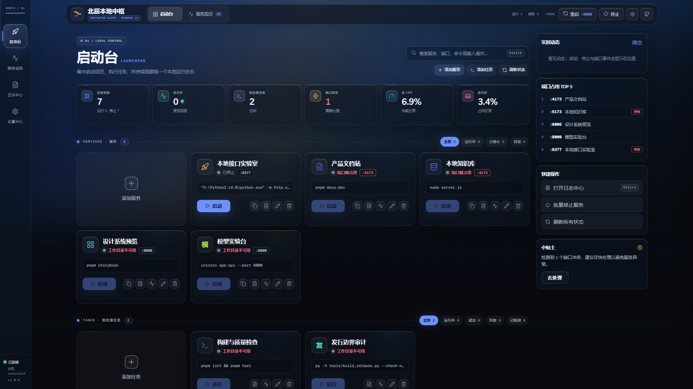
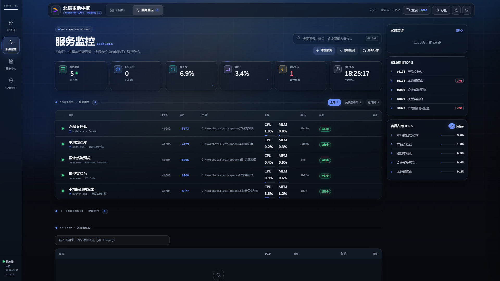

# Northstar Local Hub

[简体中文](README.md) | **English**

[](https://github.com/LEO-Ricardo20/northstar-local-hub/actions/workflows/ci.yml)
[](LICENSE)
[](WINDOWS.md)

Northstar Local Hub is a Windows 11 dashboard for launching, monitoring, and diagnosing local services and batch tasks. It brings development servers, project launch commands, and one-off scripts into a single browser interface backed by a loopback-only Python standard-library server.

> The current release is a preview. Northstar executes locally saved commands, so only add working directories and commands that you have reviewed and trust.

## Highlights

- Manage long-running services and one-off batch tasks from one launchpad.
- Start, stop, restart, inspect logs, and run preflight diagnostics.
- Monitor local listening ports, CPU usage, memory, and uptime for the current Windows user.
- Detect common launch commands for Node.js, Python, Go, Rust, and static-site projects.
- Select `.py`, `.ps1`, `.cmd`, `.bat`, and `.js` scripts through the native Windows picker.
- Track managed process trees with random run tokens, root PIDs, parent-child relationships, and the current user SID.
- Use the Northstar Glass interface with deep blue-black space, frosted glass, refracted blue light, layered transparency, light/dark/system themes, a command palette, and keyboard sorting.
- Run without runtime package installation: the backend uses only the Python standard library, while the frontend uses native HTML, CSS, and ES Modules with no CDN dependencies.

## Interface Preview

| Launchpad | Service Monitor |
| --- | --- |
|  |  |

## Requirements

- Windows 11 22H2 or later.
- Python 3.12 or later with the Python Launcher (`py.exe`).
- Windows PowerShell 5.1 or PowerShell 7.
- A modern browser with ES Module support, such as Edge, Chrome, or Firefox.

## Quick Start

```powershell
git clone https://github.com/LEO-Ricardo20/northstar-local-hub.git
cd northstar-local-hub
py -3 --version
```

For everyday use, double-click:

```text
start-windows.cmd
```

To keep the startup output visible, double-click:

```text
start-windows-debug.cmd
```

You can also start the application from PowerShell:

```powershell
py -3 server.py
py -3 server.py --no-browser
py -3 server.py --preferred-port 9603 --no-browser
```

The default address is <http://127.0.0.1:9600/>. If that port is unavailable, Northstar tries ports 9601 through 9609 in order.

## Usage

### Launchpad

- Add a service by selecting its project directory, then use a detected command or enter a command and port manually.
- Add a task for commands that are expected to finish naturally. Exit code `0` means success, while `130` means the task was cancelled by the user.
- Start, stop, restart, edit, delete, inspect logs, diagnose, and drag to reorder cards.
- Bulk stop only terminates managed process trees whose runtime identity has been verified. It does not kill unknown processes merely because they use a configured port.

### Service Monitor

- Refreshes local listening services for the current user every two seconds.
- Displays PID, port, command, load, uptime, and source information.
- Lets you add newly detected ports to the launchpad, ignore them, or temporarily dismiss the notification.
- Windows cannot reliably retrieve the current working directory of every external process. An external service can therefore be claimed only when its directory can be inferred safely. Services started by Northstar are not affected by this limitation.

### Keyboard Shortcuts

- `Ctrl+K`: open the command palette.
- `Ctrl+J`: open the log center.
- With a card focused, press Space to enter keyboard sorting mode.

## Data and Logs

The default runtime directory is:

```text
%LOCALAPPDATA%\北辰本地中枢
```

| Path | Contents |
| --- | --- |
| `%LOCALAPPDATA%\北辰本地中枢\config.json` | Services, tasks, ports, and interface settings |
| `%LOCALAPPDATA%\北辰本地中枢\config.json.bak` | Last known-good configuration backup |
| `%LOCALAPPDATA%\北辰本地中枢\icons\` | Uploaded icons and site icons |
| `%LOCALAPPDATA%\北辰本地中枢\logs\` | Application and hub logs |

On the first launch after upgrading from the legacy version, Northstar copies configuration, icons, and logs from `%LOCALAPPDATA%\总控台` when the new directory does not exist. The legacy directory is preserved, and existing files in the new directory are never overwritten.

You can override the paths with dedicated environment variables:

```powershell
$env:CONSOLE_DATA_DIR = 'D:\NorthstarData'
$env:CONSOLE_LOG_DIR = 'D:\NorthstarLogs'
py -3 server.py
```

Each variable must point to a dedicated absolute directory. Do not use a drive root, user profile directory, or project root.

## Security Boundaries

- The HTTP server binds only to `127.0.0.1`. Northstar is not a remote administration panel or a multi-user authorization system.
- Do not expose the dashboard to a LAN or the public internet through port forwarding, a reverse proxy, or similar mechanisms.
- Write operations validate the Host and Origin headers, session cookies, the current user SID, and managed process identity.
- On Windows, stopping a managed service uses `taskkill /T /F` only after process identity verification.
- Configuration and logs may contain absolute paths and complete commands. Do not commit them to Git or upload them without redaction.

See [SECURITY.md](SECURITY.md) for the vulnerability reporting process.

## Development and Verification

Run the complete project check:

```powershell
py -3 tools/check_project.py
```

Run the backend tests:

```powershell
py -3 -m unittest discover -s tests -p 'test_*.py' -v
```

Audit the release payload and build a reproducible ZIP archive:

```powershell
py -3 tools/build_release.py --check-only
py -3 tools/build_release.py --dist dist
py -3 tools/build_release.py --dist dist --verify-only
```

Regenerating the branded favicons requires the development dependency:

```powershell
py -3 -m pip install -r requirements-dev.txt
py -3 tools/gen_brand_assets.py
```

## Project Structure

```text
server.py                  Python standard-library backend
static/                    Native frontend, Northstar Glass theme, fonts, and icons
tests/                     Backend, frontend contract, and release tests
tools/check_project.py     Complete project validation
tools/build_release.py     Reproducible release builder and payload auditor
start-windows.cmd          Background Windows launcher
start-windows-debug.cmd    Windows launcher with visible diagnostic output
```

## Contributing

- Contribution guide: [CONTRIBUTING.md](CONTRIBUTING.md)
- Code of conduct: [CODE_OF_CONDUCT.md](CODE_OF_CONDUCT.md)
- Changelog: [CHANGELOG.md](CHANGELOG.md)
- Third-party notices: [THIRD_PARTY_NOTICES.md](THIRD_PARTY_NOTICES.md)
- Asset provenance: [ASSET_PROVENANCE.md](ASSET_PROVENANCE.md)

## Copyright and License

This repository is maintained by [LEO-Ricardo20](https://github.com/LEO-Ricardo20). The project is distributed under the [MIT License](LICENSE); the original copyright notice for pre-existing code and the copyright notice for this project's modifications are both preserved in the license. Fonts, Lucide icons, and branded assets remain subject to their respective licenses and provenance records in [THIRD_PARTY_NOTICES.md](THIRD_PARTY_NOTICES.md) and [ASSET_PROVENANCE.md](ASSET_PROVENANCE.md).
